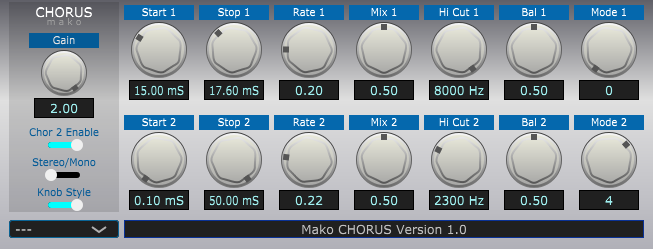

# Mako Chorus VST
* JUCE VST3 Guitar Speaker Sim.
* Demo JUCE program.
* Tested on Windows only.
* Written in Visual C++ 2022.
* Written for new programmers, not complicated.
* Version: 1.00
* Posted: June 11, 2024

VERSION
------------------------------------------------------------------
1.00 - Initial release.

DISCLAIMER
------------------------------------------------------------------  
This VST was written in a very simple way. Just simple code for
people who are not programmers but want to dabble in the magic of JUCE VSTs.

If you are new to JUCE code, the Mako Thump VST may be a better
starting place. Or be brave and try this.
       
SUMMARY
------------------------------------------------------------------
A Juce/C++ VST3 written to create a chorus effect. 



# THEORY OF OPERATION<br />
CHORUS EFFECT  
A Chorus effect is designed to make a voice/musical instrument sound like more than one
device is being played simultaneously. It does this by creating a slightly delayed echo
of the original sound. The amount of time between the original sound and the echo is
constantly changed. 

This effect creates a watery sounding echo.

The start and stop delay times are usually in the 15 to 20 mS range. These means that the
core effect is working in the 50 to 67 Hz frequency range of the original signal.

The difference in the start and stop times is called DEPTH in most chorus effect units.

How fast the echo is changed from the start and stop time is called RATE in most units.

FLANGER EFFECT  
A Flanger is very similar to a chorus effect, but uses mush shorter start and stop delay times. The rate is also shorter in most cases.

This effect creates a doppler effected sound like a jet engine is approaching your position.

The start and stop delay times are usually in the .1 to 5 mS range. These means that the
core effect is working in the 200 to 10,000 Hz frequency range of the original signal. 

COMB FILTER  
A comb filter is generically a delay. When you mix two signals and one is delayed, they will interfere with each other. This will destroy
sections of the signals frequency response. This frequency destruction is what creates the jet engine sound of the flanger.

This demo VST utilizes stereo operation for most effects. This gives the widest and best sounding effect. However, since the flanger effect is created
by removing freqency sections. Stereo operation negates the effect. Any missing freqs in one channel will be played in the other channel. So the 
listener hears less of the effect.

WEIRD EFFECTS  
This VST also employs a by product of the chorus effect. When the delay time is modulating, it alters the pitch of the effect signal being mixed. By using fixed
modulation rates and larger delay buffers, we can create weird pitch effects. This VST has three modes programmed. Each mode uses the same techniques and code,
but uses different modulation rates.

PITCH ISSUES  
A problem we have with this effect is that we need to alternate our travel up/down the start/stop regions of the delay buffer. It would be best to only modulate
in one direction. This is problematic when we switch from the stop to the start position, our signal in the delay buffer sill not be in the same point. These instant
changes will create clicks/pops/etc.

Since we need to oscillate in two directions, this effect has a bouncing modulating pitch. But you have the tools to try and make it work in one direction. Good luck.

DELAY BUFFER  
Our delay buffer is created from a float array. Each channel(L/R) has its own buffer/array. 
Each array has an integer index that tells us where we are in the buffer.
For every sample we read in, we write it to the buffer and then increment the index we are at to the next index.  
We then subtract our modulated index from the original index to get the chorus sample position.
We then mix the two array values together.

Since we have a finite amount of memory, we will have to deal with keeping our array indexes within our arrays size.

# COOL JUCE STUFFS  
This VST creates its own SLIDER control drawing routines. This is accomplished by creating a copy of the JUCE class and inheriting all of its abilites. Then you OVERRIDE
a Juce function to create your own routines.

CLASS CREATION  
```C++
//R1.00 Create a new LnF class based on Juces LnF class.
class MakoLookAndFeel : public juce::LookAndFeel_V4
{
}
```

FUNCTION OVERRIDE  
```C++  
 //R1.00 Override the Juce SLIDER drawing function so our code gets called instead of Juces code.
 void drawRotarySlider(juce::Graphics& g, int x, int y, int width, int height, float sliderPos, const float rotaryStartAngle, const float rotaryEndAngle, juce::Slider& sld) override
```

When you define a SLIDER control, you need to tell it to use your new drawing routines. 
```C++  
 //R1.00 Override the default Juce drawing routines and use ours.
 slider->setLookAndFeel(&otherLookAndFeel);
```
